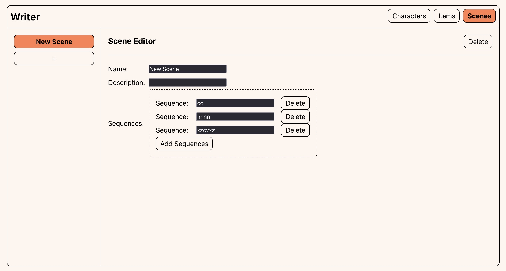

# Writer

### The Pitch
An interactive writing tool designed to take a game narrative from initial 
white-box all the way to the final story. Users can write in plain text with 
minimal markup, and the tool automatically organizes items, characters, and 
non-linear sequences of dialogue, cutscenes, and interaction events. It also 
prepares tables for localization. The resulting data can be exported directly 
to a game engine, enabling the creation of new level block-outs or updating 
existing ones.

### Current Progress
The program currently provides a basic framework for managing game entities 
like characters, items, and scenes, allowing creation, editing, and deletion 
of these elements. It features a sidebar for selecting entities and a work 
area that dynamically displays an editor based on the current selection, but 
it does not yet support complex sequences, arrays of nested objects, or full 
narrative parsing.

	

### How to Run
#### Dependencies
* Node.js
* npm

npm run dev